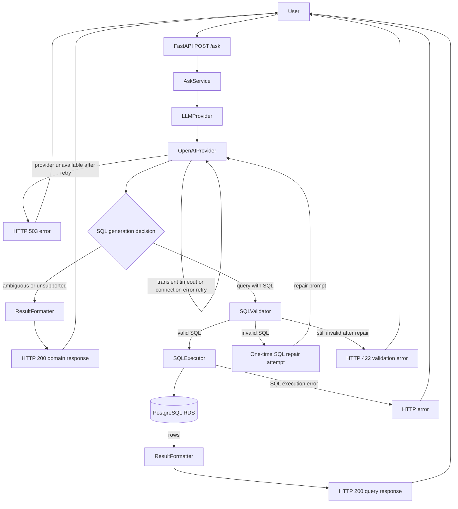

# chinook-text-to-sql

FastAPI API that answers natural language analytics questions over a PostgreSQL Chinook database by generating, validating, and executing safe read-only SQL.

## What Problem It Solves

The app lets a user ask business questions about Chinook music-store data without writing SQL. It sends the question plus a static Chinook schema context to an LLM, receives a structured decision, validates generated SQL, and executes only validated `SELECT` queries.

The app never executes raw LLM SQL directly. Generated SQL is parsed, validated, constrained to allowed Chinook tables, forced to respect a row limit, and then reconstructed before execution. Only validated SELECT queries are executed. The database user should be read-only in real environments.

## Public API Endpoints

- `GET /health`
- `GET /db-health`
- `POST /ask`

Swagger/OpenAPI is available at:

```text
http://localhost:8000/docs
```

## Local Setup

Requirements:

- Python 3.12+
- uv
- PostgreSQL database loaded with the lower_snake_case Chinook schema
- OpenAI API key

Create and activate a virtual environment:

```bash
uv venv
```

On macOS/Linux:

```bash
source .venv/bin/activate
```

On Windows PowerShell:

```powershell
.venv\Scripts\Activate.ps1
```

Install dependencies:

```bash
uv sync
```

Create a local `.env`:

```bash
cp .env.example .env
```

## Required Environment Variables

Database:

- `DB_HOST`
- `DB_PORT`
- `DB_NAME`
- `DB_USER`
- `DB_PASSWORD`

OpenAI:

- `OPENAI_API_KEY`
- `OPENAI_MODEL`, defaults to `gpt-4o-mini`
- `OPENAI_TIMEOUT_SECONDS`, defaults to `30`

Keep `.env` local. Do not commit real credentials.

## Run Locally

```bash
uv run uvicorn app.main:app --reload --host 0.0.0.0 --port 8000
```

## Test The API

Health:

```bash
curl http://localhost:8000/health
```

Database health:

```bash
curl http://localhost:8000/db-health
```

Ask:

```bash
curl -X POST http://localhost:8000/ask \
  -H "Content-Type: application/json" \
  -d '{"question":"Which are the top 5 artists by number of tracks?","max_rows":50}'
```

Ambiguous question example:

```bash
curl -X POST http://localhost:8000/ask \
  -H "Content-Type: application/json" \
  -d '{"question":"Show me the best customers","max_rows":50}'
```

Unsupported question example:

```bash
curl -X POST http://localhost:8000/ask \
  -H "Content-Type: application/json" \
  -d '{"question":"Show me current Bitcoin prices","max_rows":50}'
```

Run automated tests:

```bash
uv run pytest
```

## Docker

Build:

```bash
docker build -t chinook-text-to-sql:local .
```

Run:

```bash
docker run --rm -p 8000:8000 --env-file .env chinook-text-to-sql:local
```

## Deployment Overview

The repository includes a GitHub Actions workflow that builds the Docker image, pushes it to GHCR, and deploys it to k3s on an EC2 instance through AWS SSM.

Kubernetes manifests live in `k8s/`.

Expected Kubernetes secrets:

- `chinook-db-secret` with `DB_HOST`, `DB_PORT`, `DB_NAME`, `DB_USER`, and `DB_PASSWORD`
- `app-secrets` with `OPENAI_API_KEY`

`OPENAI_MODEL` and `OPENAI_TIMEOUT_SECONDS` are configured in the Deployment manifest. Store `OPENAI_API_KEY` as a GitHub Actions secret; do not hardcode it.

## Application Flow



The OpenAI retry path handles transient provider/network failures. The SQL repair path is different: it is one semantic correction attempt after the validator rejects generated SQL.

Security rules:

- The app never executes raw LLM SQL directly.
- Generated SQL is parsed, validated, constrained to allowed Chinook tables, forced to respect a row limit, and then reconstructed before execution.
- Only validated SELECT queries are executed.
- Multiple statements, comments, unknown tables, and mutating/admin operations are rejected.
- The database user should be read-only in real environments.
